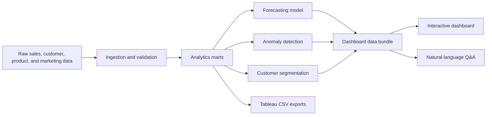

# AI-Powered Business Intelligence Dashboard


An end-to-end business intelligence system for e-commerce analytics. It takes raw sales and marketing data, builds analytics-ready marts, forecasts revenue, detects anomalies, exports Tableau-ready datasets, and presents everything through an interactive dashboard with a natural-language Q&A layer.

## Live Demo

**Launch the dashboard:** [https://prabhmehar003.github.io/AI-Powered-Business-Intelligence-Dashboard/](https://prabhmehar003.github.io/AI-Powered-Business-Intelligence-Dashboard/)

Direct dashboard path: [dashboard/](https://prabhmehar003.github.io/AI-Powered-Business-Intelligence-Dashboard/dashboard/)

## The Idea

Most dashboard projects stop at charts. This one is built like a miniature analytics product:

- It starts with raw operational data.
- It creates clean business metrics.
- It adds ML-based forecasting.
- It detects unusual revenue, margin, and marketing behavior.
- It exports Tableau-ready files for BI storytelling.
- It includes a natural-language assistant for business questions.
- It ships with a live browser dashboard, reproducible pipeline, and tests.

The result is not just a dashboard. It is a full analytics workflow that mirrors how modern data teams turn messy commerce activity into executive decisions.

## Project Highlights

| Area | What This Project Does |
| --- | --- |
| Data Engineering | Generates and ingests raw e-commerce orders, customers, products, and marketing spend |
| Analytics Modeling | Builds enriched order facts, daily KPI marts, dimensional breakdowns, and customer segments |
| Forecasting | Predicts the next 90 days of revenue using a seasonal regression model |
| Anomaly Detection | Flags unusual movement in revenue, gross margin, and ROAS |
| BI Dashboard | Provides a polished interactive dashboard with filters, KPIs, charts, anomaly events, and Q&A |
| Tableau Readiness | Exports clean CSVs and documentation for Tableau workbook creation |
| Reproducibility | Regenerates the full project from one command with deterministic outputs |

## At A Glance

| Metric | Value |
| --- | ---: |
| Raw orders generated | 70,895 |
| Customers modeled | 2,800 |
| Daily observations | 851 |
| Forecast horizon | 90 days |
| Forecast holdout MAPE | 14.8% |
| Anomaly events detected | 50 |
| Tableau export files | 6 |

Data covers **2024-01-01 to 2026-04-30**. Forecasts begin on **2026-05-01**.

## What Makes It Different

This project was designed to stand out because it connects the full analytics chain:

1. **Business framing first:** The dashboard focuses on revenue, profit, AOV, ROAS, customer value, and anomaly response instead of showing random charts.
2. **End-to-end execution:** It includes generation, ingestion, modeling, forecasting, anomaly detection, dashboarding, Tableau exports, and tests.
3. **Explainable ML:** Forecasting uses a transparent seasonal regression model rather than a hidden black box.
4. **Decision support:** Anomaly events include severity, expected value, deviation, explanation, and suggested action.
5. **Natural-language access:** Users can ask plain-English questions such as "What was revenue in the last 30 days?" or "Show the next 30 day forecast."
6. **Portfolio-ready delivery:** The project can be evaluated live through GitHub Pages and locally through the pipeline.

## Architecture



## Dashboard Features

- Executive KPI tiles for revenue, gross profit, orders, AOV, margin, ROAS, and forecast revenue
- Date, category, region, and channel filters
- Actual revenue trend with forecast overlay
- Category, region, and channel performance charts
- Anomaly event monitor with severity and action hints
- Local Q&A panel for common business questions
- Static dashboard that works through GitHub Pages

## Natural-Language Q&A Examples

```bash
python3 scripts/ask.py "What was revenue in the last 30 days?"
python3 scripts/ask.py "Which category performed best in 2026?"
python3 scripts/ask.py "Show the next 30 day forecast"
python3 scripts/ask.py "Were there anomalies in the last 90 days?"
python3 scripts/ask.py "What is our marketing ROAS this year?"
```

Example answer:

```text
Forecast revenue for the next 30 days is $541,533 with an expected range of $327,900 to $755,166. Holdout MAPE is 14.8%.
```

## Tableau Export Pack

The project includes Tableau-ready CSVs in [`data/tableau`](data/tableau):

| File | Purpose |
| --- | --- |
| `tableau_sales_model.csv` | Order-level fact table |
| `tableau_daily_metrics.csv` | Daily KPI mart |
| `tableau_daily_breakdown.csv` | Date, category, region, and channel mart |
| `tableau_forecast.csv` | 90-day revenue forecast |
| `tableau_anomaly_events.csv` | Anomaly event table |
| `tableau_customer_segments.csv` | Customer value and recency table |

Tableau documentation:

- [`tableau/dashboard_build_guide.md`](tableau/dashboard_build_guide.md)
- [`tableau/calculated_fields.md`](tableau/calculated_fields.md)
- [`tableau/data_dictionary.md`](tableau/data_dictionary.md)

## Tech Stack

| Layer | Tools |
| --- | --- |
| Core pipeline | Python standard library |
| Forecasting | Custom seasonal ridge-style regression |
| Anomaly detection | Rolling robust baseline and median absolute deviation |
| Dashboard | HTML, CSS, JavaScript, Canvas |
| Optional app | Streamlit, Pandas, Plotly |
| BI handoff | Tableau-ready CSV exports |
| Testing | Python unittest |

The core project intentionally runs without heavy dependencies, which makes it easy to clone, inspect, and reproduce.

## Repository Structure

```text
ai-powered-bi-dashboard/
  dashboard/              Interactive static dashboard
  data/raw/               Generated operational source data
  data/processed/         Analytics marts, forecasts, anomaly outputs
  data/tableau/           Tableau-ready CSV export pack
  models/                 Forecast model metadata
  scripts/                Pipeline and Q&A commands
  src/aibids/             Data, ML, anomaly, Q&A, export modules
  tableau/                Tableau build guide and calculated fields
  tests/                  Smoke tests
```

## Quick Start

Clone the repository:

```bash
git clone https://github.com/Prabhmehar003/AI-Powered-Business-Intelligence-Dashboard.git
cd AI-Powered-Business-Intelligence-Dashboard
```

Run the complete pipeline:

```bash
python3 scripts/run_pipeline.py
```

Open the local dashboard:

```bash
open dashboard/index.html
```

Run tests:

```bash
python3 -m unittest discover -s tests
```

## Optional Streamlit App

The static dashboard runs with no install. For the optional Streamlit version:

```bash
python3 -m venv .venv
source .venv/bin/activate
pip install -r requirements.txt
streamlit run streamlit_app.py
```

## Reproducibility

The pipeline is deterministic. Rerunning the pipeline regenerates raw data, processed marts, model outputs, anomaly events, Tableau exports, and the dashboard data bundle from a fixed seed.

```bash
python3 scripts/run_pipeline.py
```

## How To Evaluate This Project

If you are reviewing this repository, start here:

1. Open the [live dashboard](https://prabhmehar003.github.io/AI-Powered-Business-Intelligence-Dashboard/).
2. Inspect [`src/aibids/pipeline.py`](src/aibids/pipeline.py) to see the full orchestration.
3. Review [`src/aibids/forecast.py`](src/aibids/forecast.py) for the forecasting model.
4. Review [`src/aibids/anomalies.py`](src/aibids/anomalies.py) for anomaly detection.
5. Check [`data/tableau`](data/tableau) for BI-ready exports.
6. Run `python3 scripts/ask.py "Show the next 30 day forecast"` to test the Q&A layer.

## Business Use Cases

- Weekly executive revenue review
- Marketing efficiency monitoring
- Category and regional performance analysis
- Demand planning with forecast ranges
- Anomaly triage for revenue spikes, revenue drops, margin pressure, and ROAS movement
- Tableau workbook creation from modeled CSV exports

## Notes

This repository uses synthetic e-commerce data for demonstration. The structure is designed so real sales, customer, product, and marketing data can replace the generated source files with minimal changes to the pipeline.

## License

This project is released under the MIT License. See [`LICENSE`](LICENSE).
